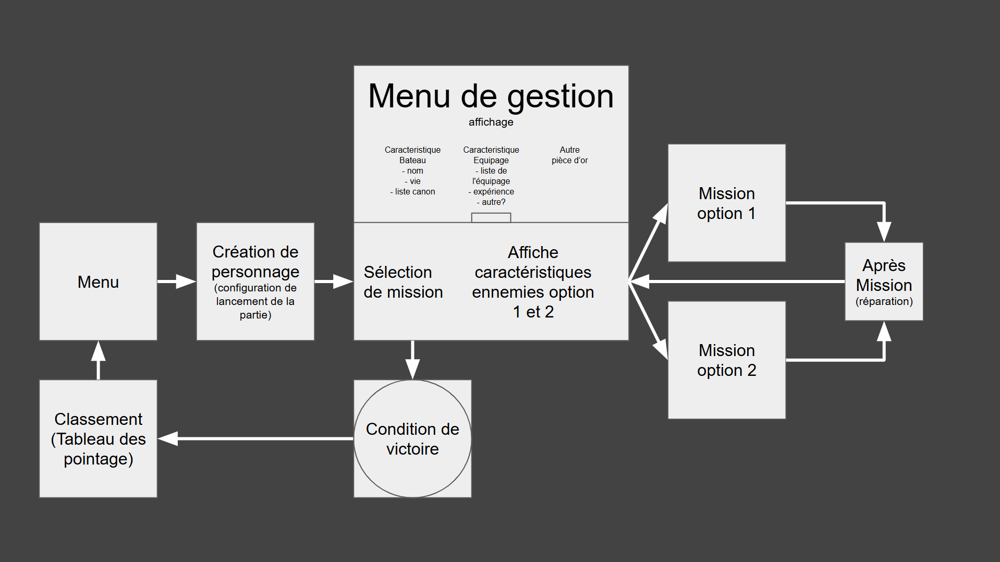
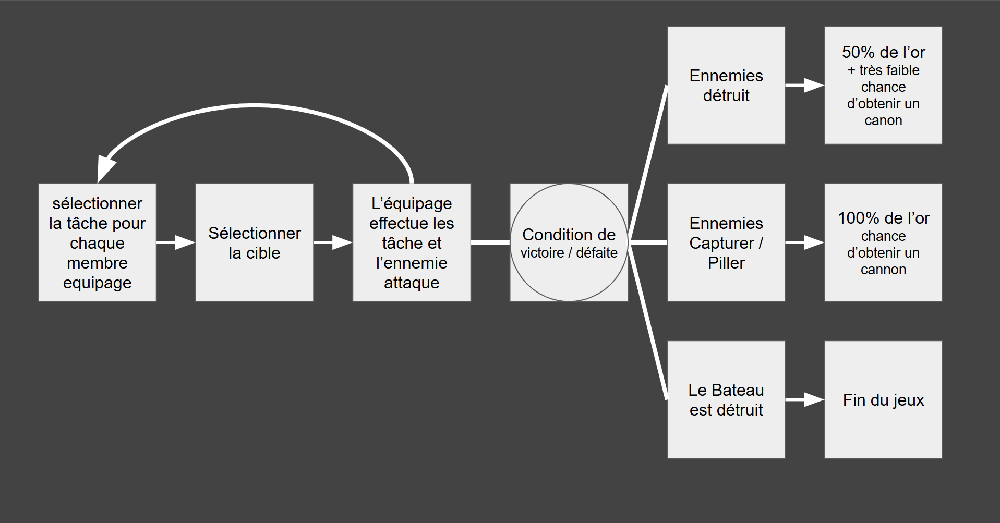
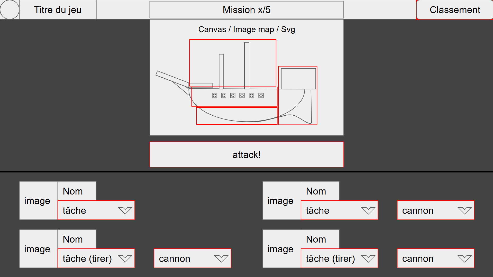

# Fichier pour faire une draft du jeu

ajoute des commentaire ou tes idées (gardont les idées même si on les utilise pas)

## Organisation du jeux (draft)



### Type de mission
(à voir lesquelle on fait)
-  Monstre des mers
    ```
    Serpent des mers
    Kraken
    Megalodon
    ```
- Bateau
    ```
    Pirate
    Corsaire
    Marine
    Bateau phantome
    ```
- Habitation
    ```
    Village
    Ville (ajouter de membres d'equipage?)
    ```

### Creation du personnage
- Le personnage peut choisir une capaciter
    Exemple
    ```
    Chasseur de prime +20% piece d'or quand bateau pirate detruit
    Corsaire auto win contre 50% des bateau de type Militaire naval (Marine)
    Harborigène un monstre marin vient t'aider en combat
    etc
    ```

## Organisation des missions (draft)



### Tâche assignable
- Observer (augmente la probabiliter de toucher)
- Tirer (tirer un canon selectioner 1 tireur par canon)
- Recharger (chaque cannon tire une deuxième fois mais avec un reduction de la precision)
- Réparer (limiter par mission)
- Éteindre les incendies (Si on implemente une mechanique d'incendie)

## Interface dans les missions (draft)

### Légende
Boite rouge =  interactible / clickable
Image de chaque membre d'equipage
__+---- logo
__V

Selection des cannons par liste defilente
(voir comment faire pour que chaque cannon soir selectionable que une fois)

(La selection des cibles vas être un peu compliquer, on a trois option possible)

Option              When to Use	                                 Difficulty
✅ SVG              Clean interactivity, scalable UI            ⭐ Easy
🟡 Image Map        You have a fixed PNG image                  ⭐⭐ Medium
🔵 Canvas           Game-style drawing & collision logic        ⭐⭐⭐ Medium-Hard
.
.
.
.
.
.
.
.
.
.
.
.
.
.
.
.
.
.
.
.
This page demonstrates usage of some of the runtime APIs provided by VitePress.

The main `useData()` API can be used to access site, theme, and page data for the current page. It works in both `.md` and `.vue` files:

```md
<script setup>
import { useData } from 'vitepress'

const { theme, page, frontmatter } = useData()
</script>

## Results

### Theme Data
<pre>{{ theme }}</pre>

### Page Data
<pre>{{ page }}</pre>

### Page Frontmatter
<pre>{{ frontmatter }}</pre>
```

<script setup>
import { useData } from 'vitepress'

const { site, theme, page, frontmatter } = useData()
</script>

## Results

### Theme Data
<pre>{{ theme }}</pre>

### Page Data
<pre>{{ page }}</pre>

### Page Frontmatter
<pre>{{ frontmatter }}</pre>

## More

Check out the documentation for the [full list of runtime APIs](https://vitepress.dev/reference/runtime-api#usedata).
